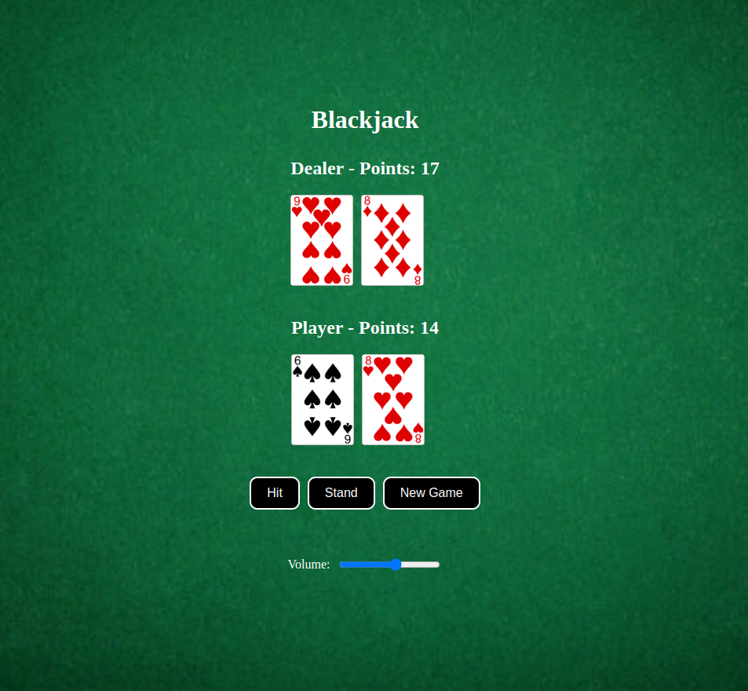

# 

## 🎮 How to Play

1. **Start the Game** – Open the game in your browser [BlackJack](http://blackjack.jeremycasanova.me).


## Objective

The goal of Blackjack is to have a hand value as close to 21 as possible without going over. Your hand's value is the sum of the values of the cards in your hand:

Number cards: The value on the card (2-10).
Face cards (Jack, Queen, King): Worth 10 points each.
Aces: Worth 1 or 11 points, whichever is more beneficial.

## Basic Rules

Game Start:

At the beginning of the game, you and the dealer are each dealt two cards.
The dealer has one card face-up, while the other is face-down.
Player's Turn:

You will be given the option to Hit (take another card) or Stand (keep your current hand).
Keep hitting until you either stand or go over 21 points, which is a "bust" and results in an automatic loss.
Dealer's Turn:

The dealer must hit if their hand is below 17 points and stand if it is 17 or higher.
If the dealer busts (goes over 21), the player wins.
Winning:

If your hand value is closer to 21 than the dealer's without going over, you win!
If both you and the dealer have the same hand value, it's a tie.
If the dealer has a hand closer to 21, you lose.

## Controls
Start Game: Click the "Start Game" button to begin the game.
Hit: Click the "Hit" button to take another card from the deck.
Stand: Click the "Stand" button to end your turn and let the dealer play.
New Game: Click the "New Game" button to start a fresh round of Blackjack.
Volume Control: Use the volume slider to adjust the game's music and sound effects.

## Scoring
Each player's score is the total value of the cards in their hand.
Aces can be worth either 1 or 11, depending on which value benefits your hand the most.
The player who gets closest to 21 without exceeding it wins the round.

## 🚀 Installation & Setup

1. Clone this repository:
   ```sh
   git clone git@github.com:Jcasanova1990/BlackJack.git

2. Navigate to the project folder:
cd GoPigeon

3. Install dependencies:
npm i

4. Build the project:
npx vite build

5. Start the development server:
npm run dev

# 🛠 Technologies Used
HTML5, Canvas,
CSS3,
JavaScript,
Vite

# 📸 Screenshots


# Thanks for Playing!